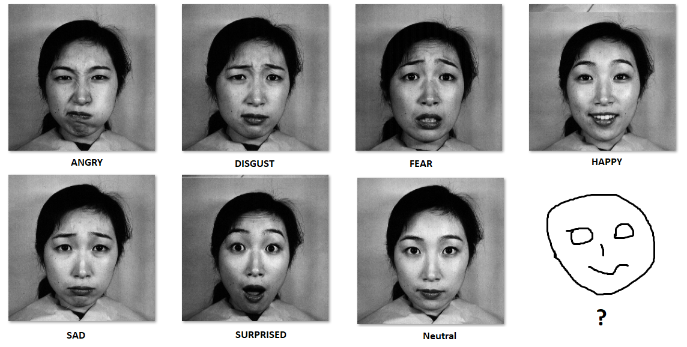
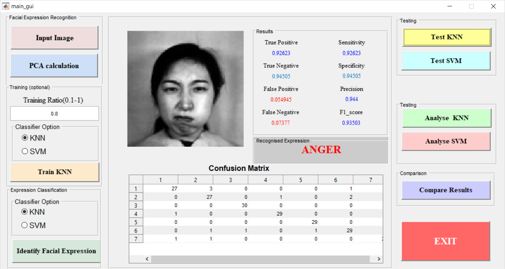
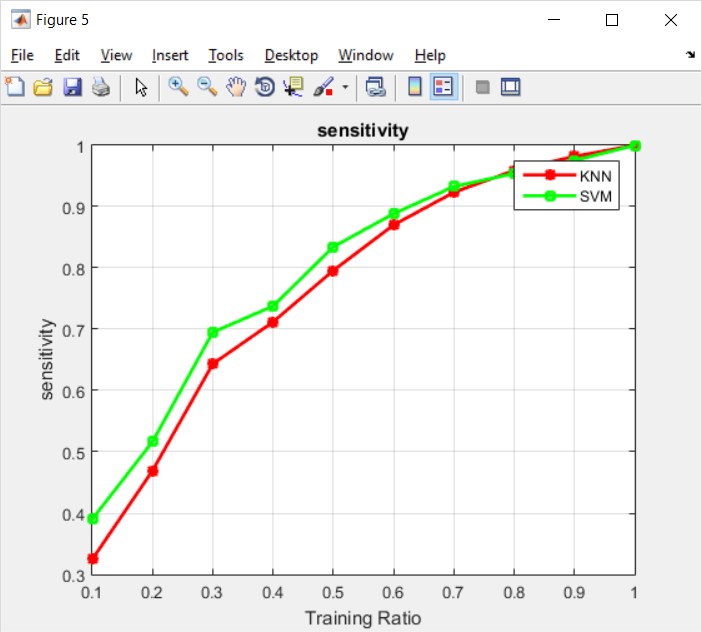
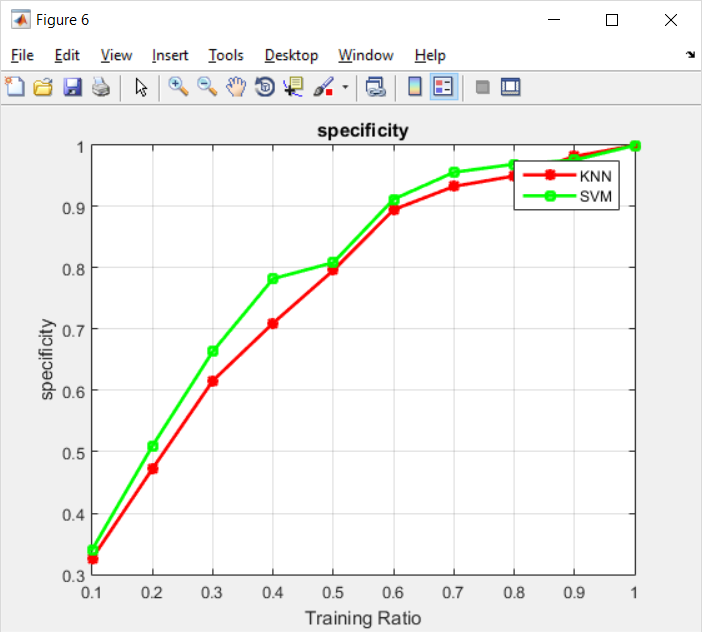
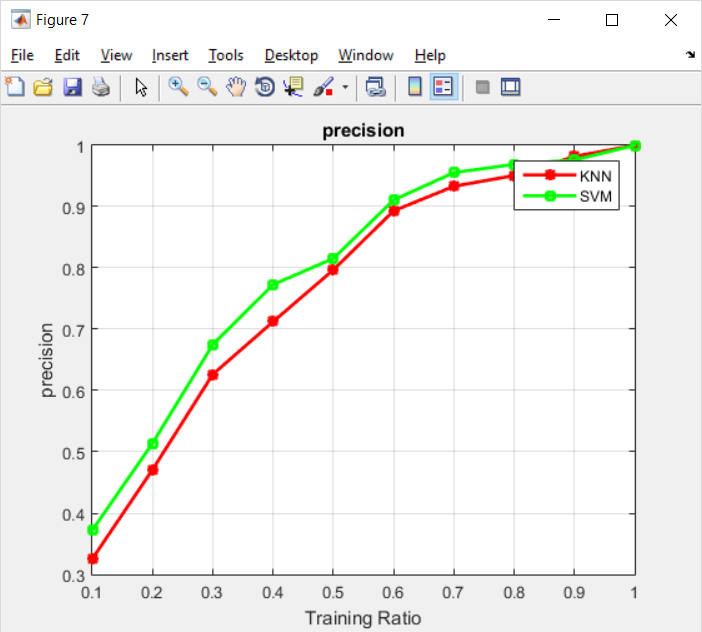

# Facial-Expression-Classification-using-KNN-SVM

This code compares the performance of PCA+KNN and PCA+SVM classifier for facial expression classification. 

The database is downloaded from http://www.kasrl.org/jaffe.html

To make it user-friendly, I have created a GUI. Just run main_gui.m file

This code is tested on MATLAB 2014

Following are the comparison graph of KNN and PCA

Conclusion:
SVM performs better than KNN
